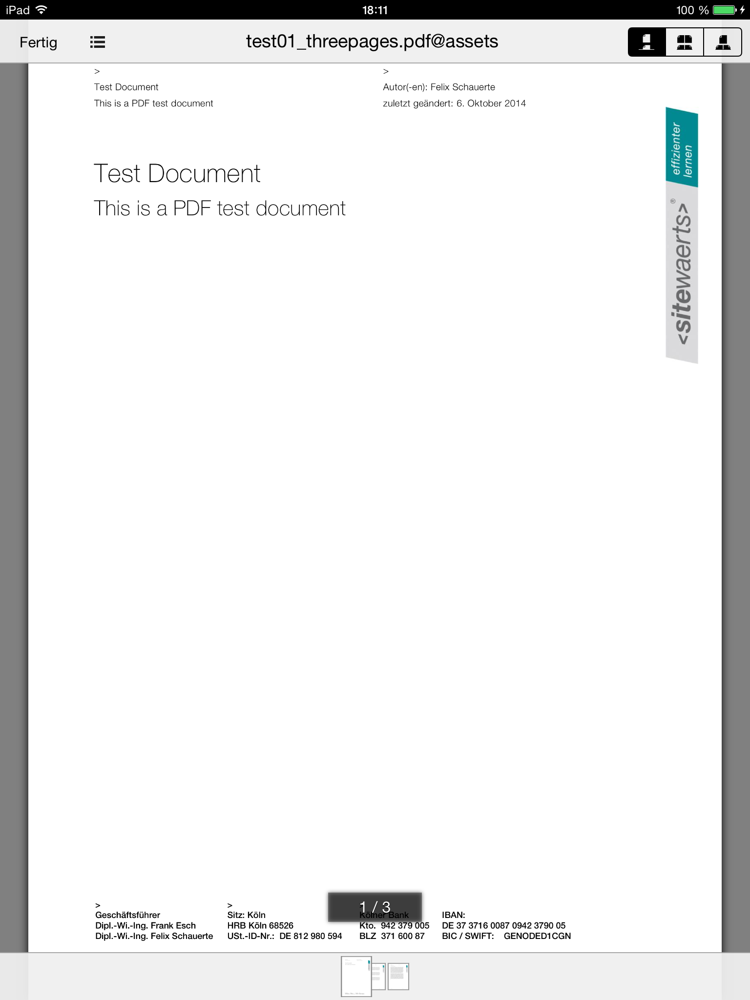
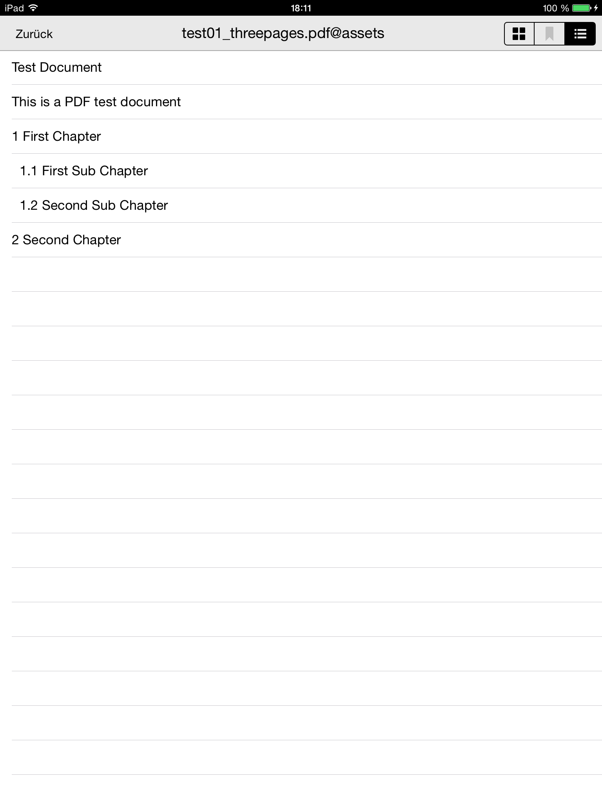
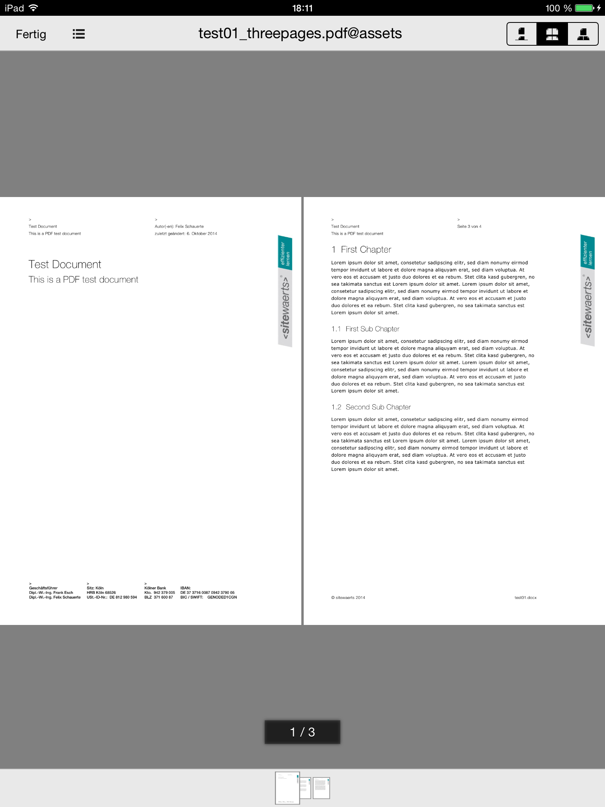
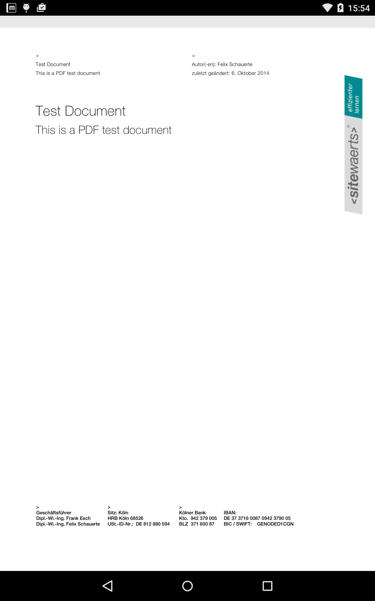
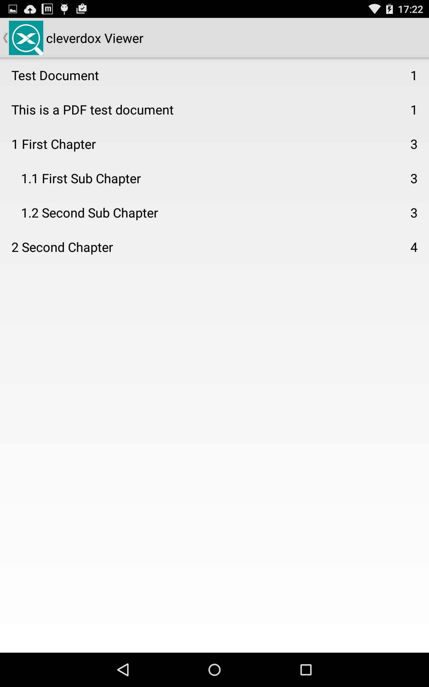

Cordova Document Viewer Plugin
============================

A common requirement when developing a cordova based app is to embed a
performant and secure inline viewer for pdf files which doesn't allow the user
to extract a copy of the pdf file out of the apps sandbox.

Simple delegation to commonly available viewer apps like Acrobat Reader or
MuPDF is no proper solution, as the app looses control over the pdf file in this case.
The external viewer app may or may not provide features to send the document
via email or save it to the devices disk, which is not acceptable.

This plugin offers a slim API to view PDF files which are either stored in the
apps assets folder (/www/*) or in any other file system directory
available via the cordova file plugin
(e.g. cordova.file.applicationDirectory, cordova.file.dataDirectory).

Online files reachable via http(s) are not supported. Download them to a temp
folder before starting the viewer. You may use the ```onClose``` callback
to cleanup the temp dir when the viewer is closed.

Viewer features like "Save as" or "Send via EMail" are configurable at runtime.

Labels for buttons (i18n) are configurable at runtime.

### Plugin's Purpose
The purpose of the plugin is to create a platform independent javascript
interface for [Cordova][cordova] based mobile applications to view different
document types by using native viewer components.

## Overview
1. [Supported Platforms](#supported-platforms)
2. [Installation](#installation)
3. [Using the plugin](#using-the-plugin)
4. [Known issues](#known-issues)

## Supported Platforms ##

* Cordova/Phonegap >=4.4.0
  * iOS 7+
  * Android 4.1+
  * Windows 8.1
  * Windows 10

## Installation ##

The plugin can either be installed from git repository, from local file system
through the [Command-line Interface][CLI],
or cloud based through [PhoneGap Build][PGB].

The plugin is published at the [npm plugin registry][CDV_plugin].

An [ionic native wrapper][ionic] for the plugin is available.

### Local development environment
From master:
```bash
# ~~ from master branch ~~
cordova plugin add https://github.com/sitewaerts/cordova-plugin-document-viewer.git
```
from a local folder:
```bash
# ~~ local folder ~~
cordova plugin add cordova-plugin-document-viewer --searchpath path/to/plugin
```
or to use the last stable version:
```bash
# ~~ stable version ~~
cordova plugin add cordova-plugin-document-viewer
```
or to use a specific version:
```bash
# ~~ stable version ~~
cordova plugin add cordova-plugin-document-viewer@[VERSION]
```

You may replace cordova with phonegap regarding to your needs.

### PhoneGap Build
Add the following xml to your config.xml to always use the latest version of this plugin:
```xml
<gap:plugin name="cordova-plugin-document-viewer" />
```
or a specific version:
```xml
<gap:plugin name="cordova-plugin-document-viewer" version="[VERSION]"/>
```
For available versions and additional information visit the [npm plugin registry][CDV_plugin].


## Using the plugin ##

See https://github.com/sitewaerts/cordova-plugin-document-viewer-sample-app for a working example.

The plugin creates the object ```cordova.plugins.SitewaertsDocumentViewer```.

### Plugin initialization
The plugin and its methods are not available before the *deviceready* event has been fired.

```javascript
document.addEventListener('deviceready', function () {
    // cordova.plugins.SitewaertsDocumentViewer is now available
}, false);
```

### Common Arguments ###

#### url ####
String pointing to a device local file (e.g. 'file:///...')

#### mimeType ####
String representing the mime type of the file. Currently only 'application/pdf' is supported.

#### options ####
Some optional features like search or bookmarks are not (yet) implemented on every platform! 
```js
var options = {
	title: STRING,
	documentView : {
		closeLabel : STRING
	},
	navigationView : {
		closeLabel : STRING
	},
	email : {
		enabled : BOOLEAN
	},
	print : {
		enabled : BOOLEAN
	},
	openWith : {
		enabled : BOOLEAN
	},
	bookmarks : {
		enabled : BOOLEAN
	},
	search : {
		enabled : BOOLEAN
	},
	autoClose: {
		onPause : BOOLEAN
	}
}
```

### Check if a Document File could be shown ###
```js
cordova.plugins.SitewaertsDocumentViewer.canViewDocument(
    url, contentType, options, onPossible, onMissingApp, onImpossible, onError);
```

#### onPossible ####
```js
function onPossible(){
  window.console.log('document can be shown');
  //e.g. track document usage
}
```

#### onMissingApp ####
```js
function onMissingApp(appId, installer)
{
    if(confirm("Do you want to install the free PDF Viewer App "
            + appId + " for Android?"))
    {
        installer();
    }
}
```

#### onImpossible ####
```js
function onImpossible(){
  window.console.log('document cannot be shown');
  //e.g. track document usage
}
```

#### onError ####
```js
function onError(error){
  window.console.log(error);
  alert("Sorry! Cannot show document.");
}
```


### Open a Document File ###
```js
cordova.plugins.SitewaertsDocumentViewer.viewDocument(
    url, mimeType, options, onShow, onClose, onMissingApp, onError, linkHandlers);
```

#### onShow ####
```js
function onShow(){
  window.console.log('document shown');
  //e.g. track document usage
}
```
#### onClose ####
```js
function onClose(){
  window.console.log('document closed');
  //e.g. remove temp files
}
```
#### onMissingApp ####
```js
function onMissingApp(appId, installer)
{
    if(confirm("Do you want to install the free PDF Viewer App "
            + appId + " for Android?"))
    {
        installer();
    }
} 
```
#### onError ####
```js
function onError(error){
  window.console.log(error);
  alert("Sorry! Cannot view document.");
}
```
#### linkHandlers ####
Currently only supported on iOS! 

Array of link handlers. Optional. 

Links in the pdf (when clicked by the user) are delegated to the first linkHandler with a matching pattern. 
If no matching pattern is found, the link is handled with the default link handler of the native viewer component (if any).  

```js
var linkHandlers = [
            {
                pattern: STRING, // string representation of a plain regexp (no flags)
                close: BOOLEAN, // shall the document be closed, after the link handler was executed?
                handler: function (link) {} // link handler to be executed when the user clicks on a link matching the pattern
            },
            {
                pattern: '^\/',
                close: false,
                handler: function (link) {
                    window.console.log('link clicked: ' + link);
                }
            }
    ];
```

### Close the viewer ###
```js
cordova.plugins.SitewaertsDocumentViewer.closeDocument(onClose, onError);
```

#### onShow ####
```js
function onClose(url){
    if(url)
        window.console.log('closed viewer document ' + url);
    else
        window.console.log('viewer not open');
}
```
#### onError ####
```js
function onError(error){
  window.console.log(error);
  alert("Sorry! Cannot close viewer.");
}
```

## iOS ##

The plugin uses the awesome VFRReader (https://github.com/vfr/Reader) to embed pdf viewer functionality in the app.

To open a pdf at a given page number add { page: pageIndex } to the options when calling viewDocument. 

### Screenshots ###

 &nbsp;&nbsp; 

 &nbsp;&nbsp; 


## Android ##

Due to license restrictions in muPDF, the plugin dispatches to a separate
(free) viewer app based on muPDF. If the viewer app is not yet installed, the user may be 
redirected to the google play app store.
 
  https://play.google.com/store/apps/details?id=de.sitewaerts.cleverdox.viewer

  https://github.com/sitewaerts/android-document-viewer
 
### Screenshots ###

 &nbsp;&nbsp; 


## Windows ##

The plugin uses 
- [Windows.Data.Pdf.PdfDocument][Windows.Data.Pdf.PdfDocument] to generate images for PDF pages
- [pdf.js][PDFJS] to display outline / table of contents

### Screenshots ###

TODO

## Known issues ##
- Add transparent support for online files.
- The external Viewer App (Android) cannot access files stored in app private directories. Due to this fact, the plugin copies a file to a shared temp folder before starting the viewer. When the viewer is closed, the temp file is immediately deleted. While the viewer is running, a sophisticated user may 'steal' the file from the shared temp directory. We are still searching for a better solution, any good idea is welcome.
- Add support for pdf forms.
- Add fulltext search features.
- Add user bookmark support.
- Add support for additional mime types like dwg, docx, etc.
- Optimize user experience for small screens. Currently the viewer components are tested and optimized on tablets only.
- Let developers provide graphics for buttons at runtime.


## Credits ##

based on https://github.com/vfr/Reader

based on https://github.com/mindstorm/CDVPDFViewer

based on [pdf.js][PDFJS]

based on [winjs][winjs]

inspired by https://github.com/pebois/phonegap-plugin-PDFViewer

inspired by https://msdn.microsoft.com/en-us/library/windows/apps/dn263105.aspx


[cordova]: https://cordova.apache.org
[CLI]: http://cordova.apache.org/docs/en/edge/guide_cli_index.md.html#The%20Command-line%20Interface
[PGB]: http://docs.build.phonegap.com/en_US/index.html
[CDV_plugin]: https://www.npmjs.com/package/cordova-plugin-document-viewer
[PDFJS]: https://mozilla.github.io/pdf.js/
[Windows.Data.Pdf.PdfDocument]: https://msdn.microsoft.com/en-us/library/windows/apps/windows.data.pdf.pdfdocument
[winjs]: http://try.buildwinjs.com/
[ionic]: https://github.com/driftyco/ionic-native/tree/master/src/@ionic-native/plugins/document-viewer

